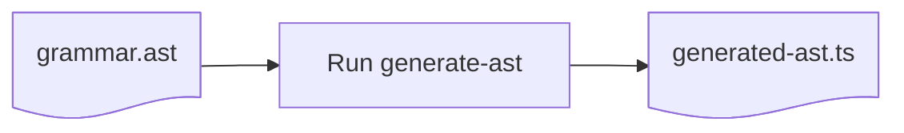

[](https://www.npmjs.com/package/ast-generator)
[](https://github.com/nvie/ast-generator/actions)

AST generator is a command line tool that will help you generate TypeScript code for
arbitrary ASTs



It’s recommended to create the following standard file structure:

```
mylang/
  grammar.ast        // The input grammar
  generated-ast.ts   // The generated TypeScript module
  index.ts           // You define semantics here
```

## Example grammar

Let’s define an example AST for a simple drawing program.

The following grammar definition (in a file called `grammar.ast`) describes three nodes
(Document, Circle, Rect), and one union (Shape), with various properties.

```ts
// grammar.ast

Document {
  version?: number
  shapes: @Shape*
}

@Shape =
  | Circle
  | Rect

Circle {
  cx: number
  cy: number
  r: number
}

Rect {
  x: number
  y: number
  width: number
  height: number
}
```

## What will be generated?

This definition will generate a TypeScript module with the following things in it.

#### Types for nodes and unions

```ts
export type Node = Document | Shape | Circle

export type Document = {
  _kind: "Document"
  version: number | null
  shapes: Shape[]
}

export type Shape = Circle | Rect

export type Circle = {
  _kind: "Circle"
  cx: number
  cy: number
  r: number
}

export type Rect = {
  _kind: "Rect"
  x: number
  y: number
  width: number
  height: number
}
```

#### Constructors for nodes

Each node will get a lowercased function to construct the associated node type.

```ts
export function document(version: number | null, shapes: Shape[]): Document {}
export function circle(cx: number, cy: number, r: number): Circle {}
export function rect(x: number, y: number, width: number, height: number): Rect {}
```

> [!NOTE]  
> Note that there is no constructor for a "shape". A shape is either a circle or a rect.

#### Predicates for unions

```ts
export function isShape(node: Node): node is Shape {}
```

## Usage

This definition will generate a TypeScript module you can use as follows in your
`index.ts`:

```ts
import type { Document, Shape, Rect, Circle } from "./generated-ast"
import { document, rect, circle } from "./generated-ast"
import { isShape } from "./generated-ast"
```

Another way to import is using a `* as` import.

```ts
import * as G from "./generated-ast"
```

A full example:

```ts
import * as G from "./generated-ast"

const mydoc = G.document(1, [
  G.circle(10, 10, 5),
  G.rect(0, 0, 10, 10),
  G.circle(20, 20, 10),
])

console.log(mydoc.shapes[0].type) // "Circle"
console.log(mydoc.shapes[0].cx) // 10

console.log(G.isShape(mydoc)) // false
console.log(G.isShape(mydoc.shapes[0])) // true
```

## Settings (TODO)

> [!NOTE]  
> The following does not exist yet, but I want to add support for this!
>
> - Add setting to change the discriminator field
> - Default the discriminator to `type`, not `_kind`

## Assigning semantic meaning to nodes

An abstract syntax tree represents something you want to give meaning to. To do this, you
can define custom properties and methods that will be available on every node.

For example:

```ts
// grammar.ast

external property area
external method prettify()
external method check()

Document {
  version?: number
  shapes: @Shape*
}

// etc
```

> [!NOTE]  
> Don't forget to re-run the code generator after changing the grammar.

After this, it will be as if every node (Document, Circle, Rect) have a `area` property
and `prettify` and `check` methods.

But what does the `area` property return? And what do `prettify` or `check` do? That’s
completely up to you!

### Defining a semantic property

In your `index.ts`, let’s define the `area` property:

```ts
// index.ts
import * as G from "./generated-ast"

declare module "./generated-ast" {
  interface Semantics {
    area: number // 1️⃣
  }
}

// 2️⃣
G.defineProperty("area", {
  Circle: (node) => Math.PI * node.r * node.r,
  Rect: (node) => node.width * node.height,
})

const mydoc = G.document(1, [
  G.circle(10, 10, 5),
  G.rect(0, 0, 10, 10),
  G.circle(20, 20, 10),
])

console.log(mydoc.shapes[0].area) // 78.54
console.log(mydoc.shapes[1].area) // 100
console.log(mydoc.area) // Error: Semantic property 'area' not defined on 'Document'
```

Step 1️⃣ is to augment the `Semantics` interface. This will make TypeScript understand that
every node in the AST will have an `area` property that will be a number.

Step 2️⃣ is to define how the `area` property should be computed for each specified node
type. The return types will have to match the type you specified in the `Semantics`
augmentation.

Note that in this case, we defined the property partially. An `area` is not defined on the
Document node type. This is a choice. If it makes sense, we could also choose to implement
it there, for example, by summing the areas of all the shapes inside it.

### Defining a semantic methods

```ts
// index.ts
import * as G from "./generated-ast"

declare module "./generated-ast" {
  interface Semantics {
    area: number

    // 1️⃣ Add these
    prettify(): string
    check(): void
  }
}

// 2️⃣
G.defineMethod("prettify", {
  Node: (node) => JSON.stringify(node, null, 2),
})

// 2️⃣
G.defineMethod("check", {
  Circle: (node) => {
    if (node.r < 0) {
      throw new Error("Radius must be positive")
    }
  },

  Rect: (node) => {
    if (node.width < 0 || node.height < 0) {
      throw new Error("Width and height must be positive")
    }
  },
})

const mydoc = G.document(1, [
  G.circle(10, 10, 5),
  G.rect(0, 0, 10, 10),
  G.circle(20, 20, 10),
])

console.log(mydoc.shapes[0].area) // 78.54
console.log(mydoc.shapes[1].area) // 100
console.log(mydoc.area) // Error: Semantic property 'area' not defined on 'Document'
```

### Should I use a property or method?

It depends what you want. Both are lazily evaluated, but properties will be evaluated at
most once for each node, and be cached. Methods will be re-evaluated every time you call
them.

To clarify the difference, suppose you add a `randomProp` property and a `randomMethod`,
both with the same implementation.

```ts
G.defineMethod("random", {
  Node: (node) => Math.random(),
})

mynode.random() // 0.168729
mynode.random() // 0.782916
```

Versus:

```ts
G.defineProperty("random", {
  Node: (node) => Math.random(),
})

mynode.random // 0.437826
mynode.random // 0.437826 (cached!)
```

### Cross-calling

Both methods and properties can use other semantic properties or methods in their
definitions, which makes them very powerful. As long as there is no infinite loop, you’re
free to write them however.

For example, in the definition of `check`, we could choose to rely on the `area` property:

```ts
G.defineMethod("check", {
  Circle: (node) => {
    if (node.area < 0) {
      throw new Error("Area must be positive")
    }
  },
  React: (node) => {
    if (node.area < 0) {
      throw new Error("Area must be positive")
    }
  },
})
```

### Partial or exhaustive?

When authoring semantic properties or methods, you can choose to define them partially
(e.g. not all node types necessarily have an `area`) or to define them exhaustively (e.g.
all nodes should have a `prettify()` output defined). This depends on the use case.

When defining the semantics, you can pick between:

- `defineProperty()` allows partial definitions
- `definePropertyExhaustively()` will require a definition for every node type

The benefit of using `definePropertyExhaustively` is that if you add a new node to the
grammar, TypeScript will help you remember to also define the semantics for it.

Similarly:

- `defineMethod()`
- `defineMethodExhaustively()`
